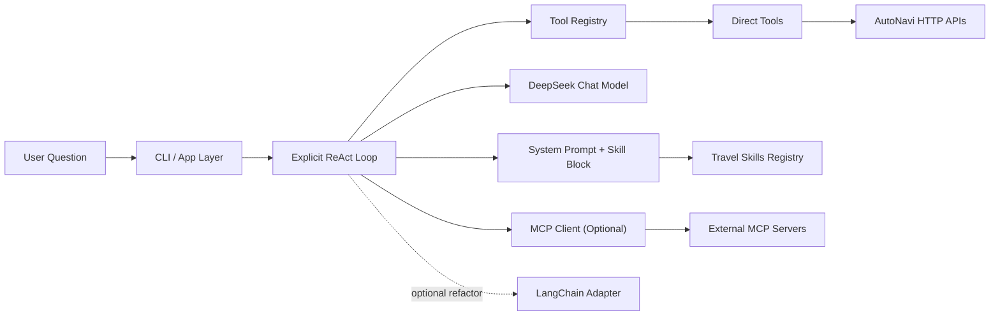

# Architecture Notes

This tutorial keeps five concepts separate on purpose:

- `Tool`: a concrete capability under your control, usually a function or API wrapper.
- `ToolRegistry`: the translation layer that turns Python tools into model-callable schemas.
- `Skill`: a reusable planning pattern that teaches the agent how to apply tools well in a domain.
- `MCP capability`: a tool or resource exposed by another process through a standard interface.
- `LangChain`: an optional orchestration layer that can wrap the lower-level pieces once you understand them.

## Why this split matters

If you put every behavior into one giant prompt, you get a fragile agent. A stronger design puts each concern in its own seam:

- prompts explain policy
- tools do deterministic work
- registries expose tools in a model-friendly way
- skills package repeatable expertise
- MCP makes shared capabilities portable across agents and IDEs

## Diagram

## Best-practice rules used in this scaffold

1. Keep business logic in your code, not buried in the model prompt.
2. Start with direct tools and an explicit loop before introducing orchestration frameworks.
3. Use a registry layer to standardize tool schemas and execution.
4. Use skills to capture domain workflows that should be reusable across prompts or agents.
5. Promote tools into MCP only when reuse, lifecycle, or governance justify the extra boundary.
6. Add evaluation and lessons learned early so the project can grow without turning into prompt soup.
