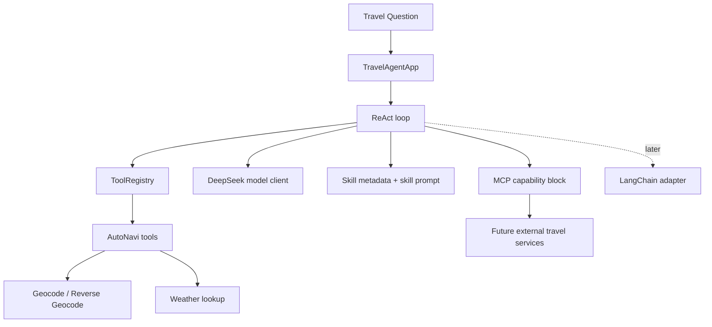

# Tutorial Plan

This repository is the skeleton for a travel-planning agent powered by `DeepSeek`, `AutoNavi`, file-based `Skills`, optional `MCP` capabilities, and a later `LangChain` integration.

This plan is aligned to the local article PDF in [docs/【万字】带你实现一个Agent（上），从Tools、MCP到Skills.pdf](/Users/danielwong/Dev/travel_agent/docs/【万字】带你实现一个Agent（上），从Tools、MCP到Skills.pdf), plus current DeepSeek, MCP, and AutoNavi docs. The article's core progression is:

- start with direct `Tools`
- standardize them with a `ToolRegistry`
- run an explicit ReAct-style tool loop
- introduce `MCP` for reusable long-lived capability services
- add `Skills` as progressive-disclosure task modules
- wrap with `LangChain` only after the fundamentals are clear

## Outcome

By the end of the tutorial you should be able to build an agent that:

- uses `DeepSeek` as the reasoning model through an OpenAI-compatible API
- calls `AutoNavi` tools for grounded travel data
- exports tools through a registry instead of hand-writing model schemas everywhere
- applies file-based skills instead of relying on a monolithic prompt
- leaves a clean extension point for shared MCP servers
- optionally wraps the foundation in LangChain after you understand the raw loop
- has tests, lessons learned, and a backlog for future refactors

## Architecture at a glance



## Step map

1. `Step 1`: Understand the boundaries between tools, MCP, skills, and orchestration.
2. `Step 2`: Configure Python, `uv`, secrets, CLI, and the local developer workflow.
3. `Step 3`: Implement and validate direct AutoNavi tools.
4. `Step 4`: Build the first DeepSeek tool loop with a `ToolRegistry` and explicit ReAct cycle.
5. `Step 5`: Layer in file-based skills with progressive disclosure.
6. `Step 6`: Add an MCP seam for reusable long-lived travel capabilities.
7. `Step 7`: Add a LangChain adapter, tests, evaluation cases, and hardening.
8. `Step 8`: Run a retrospective and update the README with what you learned.

## Repository layout

```text
docs/
  architecture.md
  tutorial_plan.md
  lessons_learned.md
  future_todo.md
  steps/
skills/
src/travel_agent/
  agent/
  clients/
  mcp/
  prompts/
  schemas/
  tools/
  tool_registry.py
tests/
```

## How to use this tutorial

- Read the current step in `docs/steps`.
- Finish the requested code or configuration task.
- If you get stuck, add the issue to `docs/lessons_learned.md`.
- If you complete a step cleanly, add stretch ideas to `docs/future_todo.md`.
- At the end, update `README.md` with a short retrospective.

## Selected product slice

The tutorial will target this first narrow user story:

`Plan a weather-aware 2-day weekend trip in Hangzhou for food and walking, grounded with AutoNavi data.`

## Coaching method

The implementation style for this tutorial is:

- I provide the step goal, concepts, interfaces, and acceptance checks.
- I leave method bodies intentionally incomplete when you want to implement them yourself.
- After you implement a step, I review the code against the acceptance criteria and either approve it or point out concrete fixes.
- Once a step is approved, I extend the docs with deeper knowledge and future stretch challenges.

## Current step

Start with [docs/steps/step-01-foundation.md](/Users/danielwong/Dev/travel_agent/docs/steps/step-01-foundation.md).
